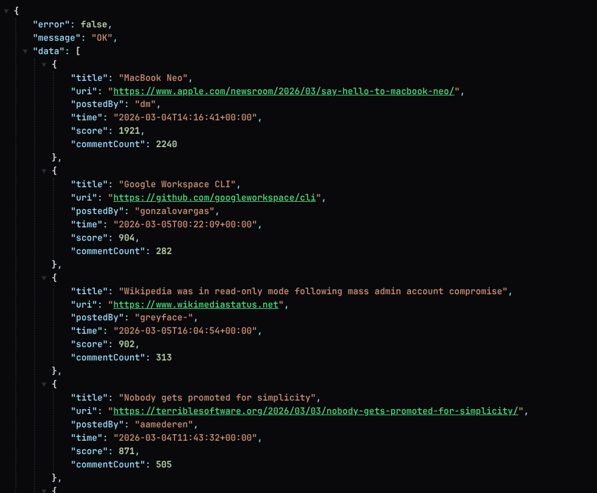

# Hacker News Best Stories API

REST API that returns the best _n_ stories from the [Hacker News API](https://github.com/HackerNews/API), sorted by score (descending). ASP.NET Core minimal API.



## How to run

- **Prerequisites:** [.NET 10 SDK](https://dotnet.microsoft.com/download).
- **Run:** `dotnet run` — API is at http://localhost:5077 (or https://localhost:7273).
- **Endpoint:** `GET /api/beststories?n=5` (replace 5 with desired count).
- **Swagger (Development):** http://localhost:5077/swagger

Example:

```bash
curl "http://localhost:5077/api/beststories?n=5"
```

## Assumptions

- HN endpoints: `beststories.json` for IDs, `item/{id}.json` for details. `uri` in the response is the HN item’s `url` (may be null for Ask HN, etc.).
- `n` is validated between 1 and a configurable max (default 100). Invalid `n` returns 400.
- Caching (IDs + per-item, configurable TTL in `appsettings.json`) is used so high request volume does not overload the HN API. Items without `title`/`score` are skipped.

## Enhancements (given more time)

- **Resilience:** Polly retries/circuit breaker on the HN HTTP client.
- **Caching:** Redis (or other distributed cache) for multi-instance deployments.
- **Rate limiting:** Per-client or per-IP limits.
- **Observability:** Structured logging, metrics, health check (optionally probing HN).
- **Tests:** Unit tests for the service (mocked client/cache); integration test for the endpoint.
- **Config validation:** Validate options at startup (e.g. base URL and cache durations set and valid).
